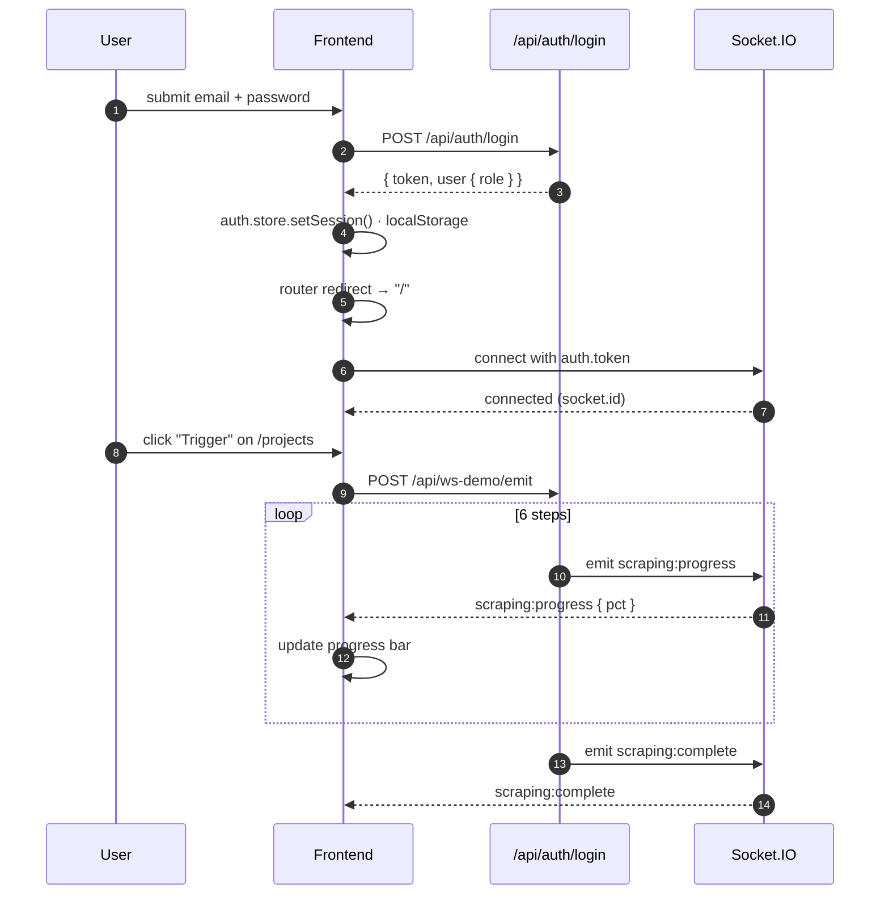
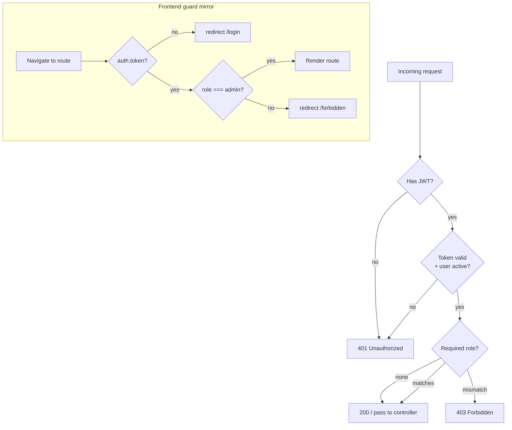
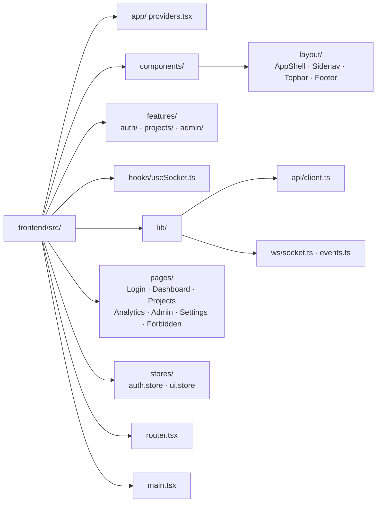

# Sprint 01 — Implementation Report

> Companion to `sprint_plan.md`. Captures what was actually built, how the pieces fit, and how to run/verify locally.

---

## 1. Outcome at a glance

| Area | Status | Notes |
|---|---|---|
| Backend RBAC (user, admin) | ✅ Done | `requireRoles(...)` helper + admin routes |
| Backend admin endpoints (users, stats) | ✅ Done | `/api/admin/*` |
| Backend Socket.IO server (JWT-auth, rooms) | ✅ Done | `src/config/socket.js` |
| Backend WS event catalogue | ✅ Done | `src/ws/events.js` |
| Backend WS demo emitter | ✅ Done | `POST /api/ws-demo/emit` |
| Frontend scaffold (Vite + React + TS + Tailwind v3) | ✅ Done | builds cleanly |
| TanStack Query + TanStack Router | ✅ Done | RBAC-aware route guards |
| Axios client with JWT interceptor + 401 auto-logout | ✅ Done | `src/lib/api/client.ts` |
| Zustand auth store (persisted) + UI store (drawer) | ✅ Done | `src/stores/*` |
| App shell — Sidenav drawer + Topbar + Footer | ✅ Done | mobile-first |
| Pages — Login, Dashboard, Projects, Analytics, Admin, Settings, 403 | ✅ Done | wired to real backend |
| Recharts — KPIs, Line, Bar, Pie | ✅ Done | Dashboard + Analytics |
| Socket.IO client + `useSocket(projectId)` hook | ✅ Done | auto-reconnect |
| Live progress UI driven by WS events | ✅ Done | visible on `/projects` |

---

## 2. Final architecture

```mermaid
flowchart LR
    subgraph FE["Frontend · Vite + React 19 + TS"]
        direction TB
        Pages[Pages<br/>Login · Dashboard · Projects<br/>Analytics · Admin · Settings]
        Shell[AppShell<br/>Sidenav drawer · Topbar · Footer]
        Router[TanStack Router<br/>RBAC guards]
        Query[TanStack Query]
        Auth[Zustand auth.store<br/>persisted to localStorage]
        UI[Zustand ui.store<br/>drawerOpen]
        Axios[Axios client<br/>JWT interceptor]
        WSClient[Socket.IO client<br/>useSocket hook]
        Charts[Recharts]
        Pages --> Shell
        Shell --> Router
        Pages --> Query
        Pages --> Charts
        Pages --> WSClient
        Query --> Axios
        Axios --> Auth
        WSClient --> Auth
    end

    subgraph BE["Backend · Express + Socket.IO + Mongoose"]
        direction TB
        REST[REST /api/*<br/>auth · projects · competitors<br/>market-research · classification<br/>scraping · admin · ws-demo]
        Protect[protect middleware<br/>JWT verify]
        RBAC[requireRoles middleware]
        IO[Socket.IO server<br/>JWT handshake auth<br/>rooms: project:{id}]
        Pipeline[Pipeline services]
        Mongo[(MongoDB Atlas)]
        REST --> Protect --> RBAC
        REST --> Mongo
        Pipeline --> Mongo
        Pipeline -. emits .-> IO
    end

    Axios -->|Bearer JWT| REST
    WSClient <-->|handshake.auth.token| IO
```

### 2.1 Request + auth flow



### 2.2 RBAC decision tree



---

## 3. Backend changes

| File | Change |
|---|---|
| `backend/package.json` | + `socket.io@^4` |
| `backend/server.js` | Now wraps `app` in `http.createServer` and calls `initSocket(server)` before listen |
| `backend/src/config/env.js` | Added `FRONTEND_URL` + every pipeline API key re-exported |
| `backend/src/config/socket.js` | **new** — Socket.IO singleton, JWT `io.use`, per-project rooms, `emitToProject` / `broadcast` helpers |
| `backend/src/ws/events.js` | **new** — canonical event names (mirrored on frontend) |
| `backend/src/middlewares/auth.middleware.js` | Added `requireRoles(...allowedRoles)` helper |
| `backend/src/controllers/admin.controller.js` | **new** — list/get/updateRole/toggleActive/delete users + stats |
| `backend/src/routes/admin.routes.js` | **new** — all routes gated by `protect + requireRoles('admin')` |
| `backend/src/routes/ws-demo.routes.js` | **new** — `POST /api/ws-demo/emit` to stream fake scraping progress |
| `backend/src/routes/index.js` | Registered `/api/admin` and `/api/ws-demo` |

### 3.1 New endpoints

```
GET    /api/admin/stats                      → counts (users, active, admins, projects)
GET    /api/admin/users?q=&role=&isActive=   → list users
GET    /api/admin/users/:id                  → single user
PATCH  /api/admin/users/:id/role             → { role: 'user' | 'admin' }
PATCH  /api/admin/users/:id/toggle-active    → flip isActive
DELETE /api/admin/users/:id                  → hard delete (cannot delete self)
POST   /api/ws-demo/emit                     → { projectId?, steps? } streams progress
```

### 3.2 WebSocket contract

| Direction | Event | Payload |
|---|---|---|
| S → C | `scraping:started` | `{ projectId, competitorCount, at }` |
| S → C | `scraping:progress` | `{ projectId, step, pct, competitorId?, message?, at }` |
| S → C | `scraping:complete` | `{ projectId, summary, at }` |
| S → C | `scraping:failed` | `{ projectId, error, at }` |
| S → C | `research:progress` | `{ projectId, step, pct, at }` |
| S → C | `classification:complete` | `{ projectId, at }` |
| S → C | `notification` | `{ level, message, at }` |
| C → S | `join` | `{ projectId }` |
| C → S | `leave` | `{ projectId }` |
| C → S | `ping` | `—` (server replies `pong`) |

**Rule:** WS is a trigger. Clients on `*:complete` invalidate their TanStack Query cache and refetch via REST. WS never carries raw business data.

---

## 4. Frontend layout

### 4.1 Folder tree



### 4.2 Sidenav / drawer behavior

- Desktop (`lg:` ≥ 1024px) — sticky sidebar, always visible.
- Mobile — transforms off-canvas; opened via `Topbar` hamburger.
- Clicking a nav link on mobile auto-closes the drawer (via `ui.store.setDrawer(false)`).
- Admin-only entries hidden when `auth.store.user.role !== 'admin'`.

### 4.3 Footer

Shows system name (**PFE Marketing Intelligence Agent**), version tag, copyright line with auto-updating year, GitHub link, and built-by credit. Consistent across every authenticated route.

---

## 5. How to run locally

### 5.1 Backend

```bash
cd backend
npm install            # once
npm run dev            # nodemon on :5000 — starts HTTP + Socket.IO
```

Expected log:
```
🚀 SERVEUR DÉMARRÉ AVEC SUCCÈS
📡 URL: http://localhost:5000
🔌 WS : ws://localhost:5000
```

### 5.2 Frontend

```bash
cd frontend
npm install            # once
npm run dev            # Vite on :5173
npm run build          # production build (verified clean)
```

Vite proxies `/api` and `/socket.io` to `localhost:5000`, so no CORS fiddling in dev.

### 5.3 End-to-end smoke test

1. Open `http://localhost:5173` → redirected to `/login`.
2. Register a user (defaults to `role: 'user'`).
3. Lands on `/` with KPIs + charts populated.
4. Sidenav: click **Admin** → redirected to `/forbidden`. ✅ RBAC working.
5. In MongoDB Atlas (or via a seed admin), update your user's `role` to `"admin"`.
6. Log out, log back in → **Admin** link now visible, `/admin` renders the users table + stats.
7. Go to **Projects**, leave projectId as `demo`, click **Trigger** → live progress bar fills to 100% driven by Socket.IO events.

### 5.4 Seeding the database

A seed script creates an admin account, a demo user, a sample project, and 4 competitors.

```bash
cd backend
npm run seed           # idempotent — skips records that already exist
npm run seed:reset     # ⚠ wipes users / projects / competitors first
```

Credentials created:

| Role  | Email             | Password   |
|-------|-------------------|------------|
| admin | admin@pfe.local   | Admin123!  |
| user  | user@pfe.local    | User123!   |

> ⚠ Do **not** run `seed:reset` against a shared environment — it deletes all users, projects, and competitors. Safe for local dev only.

### 5.5 Creating an admin directly

Either change role in MongoDB Atlas, or (quickest) via another admin call:

```bash
curl -X PATCH http://localhost:5000/api/admin/users/<USER_ID>/role \
  -H "Authorization: Bearer <ADMIN_TOKEN>" \
  -H "Content-Type: application/json" \
  -d '{"role":"admin"}'
```

For the very first admin, promote yourself with a one-liner mongo shell:

```js
db.users.updateOne({ email: "you@example.com" }, { $set: { role: "admin" } });
```

---

## 6. Deviations from the plan

| Plan | Reality | Why |
|---|---|---|
| Next.js considered, chose Vite | **Vite + React 19** (scaffold produced React 19 + Vite 8) | `npm create vite` produced the newest template; no blockers |
| Tailwind v4 unspecified | **Tailwind v3.4** | v3 has the stable `init -p` flow and familiar PostCSS plugin chain |
| Epic E4 — emit from pipeline services | Deferred; emitter wired through `config/socket.js`, pipeline services unchanged | Non-trivial refactor across `scraping.unified.js` etc.; `ws-demo` proves the channel works. Add emits incrementally next sprint |
| Login + register as separate pages | Single **LoginPage** with mode toggle | Simpler, fewer routes, same UX |
| Real analytics from backend | **Mock data** in charts | Analytics endpoints not yet built; charts are wired to real structures so swap is trivial |

---

## 7. Security notes

- JWT in `localStorage` via Zustand `persist`. Known XSS trade-off; acceptable for MVP, flagged for Sprint 03.
- Socket.IO handshake enforces JWT — unauthenticated sockets get `unauthorized` and never join a room.
- Admin routes require **both** `protect` (valid token) **and** `requireRoles('admin')`. Order matters — `protect` must run first so `req.user` is populated.
- Frontend mirrors backend RBAC via `beforeLoad` guards on routes. Mirroring, not enforcement — the real gate is server-side.
- Admin cannot delete their own account (checked in controller).

---

## 8. Next steps

- **Sprint 02:** Emit real events from `scraping.unified.js`, `marketResearch.service.js`, `classification.service.js`. Replace mock chart data with backend aggregates. Campaign generator UI with streaming LLM output over WS.
- **Sprint 03:** Move JWT to httpOnly cookie + refresh tokens; add rate limiting on auth + admin; audit log for admin actions.
- **Nice-to-have:** Dark mode (tokens are ready via Tailwind `darkMode: 'class'`); toast provider; i18n FR/EN.
