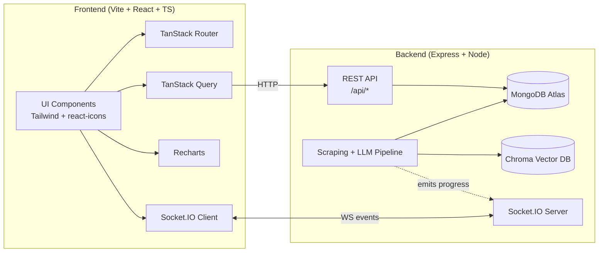
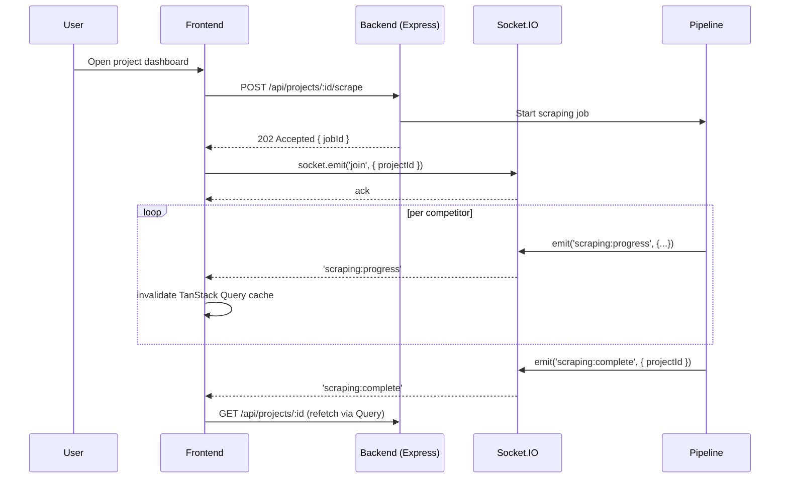
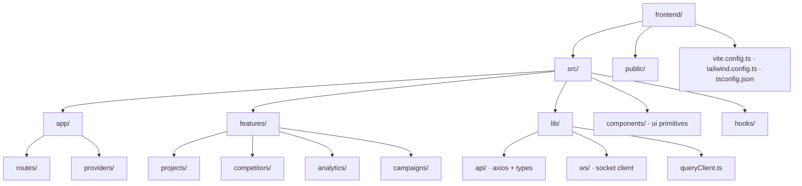
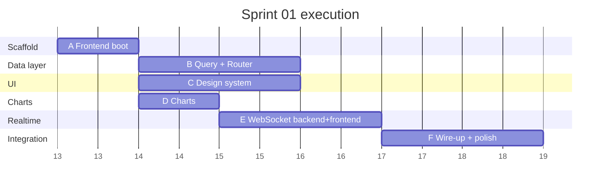
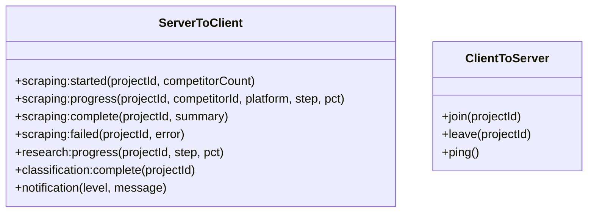

# Sprint 01 — Frontend Foundation + Real-Time Pipeline

> **Goal:** Scaffold the frontend application, wire core libraries (TanStack Query, TanStack Router, Tailwind CSS, react-icons, Recharts), and establish a bidirectional WebSocket channel so scraping / analysis progress streams live from the backend to the dashboard.

---

## 1. Sprint Intent

The backend pipeline (competitor discovery → scraping → RAG → campaign generation) is long-running and asynchronous. A polling-based UI would be wasteful and slow. This sprint puts in place:

1. A modern React SPA foundation.
2. Server-state management (TanStack Query) for REST endpoints.
3. Type-safe routing (TanStack Router) for multi-page dashboard.
4. A design system (Tailwind + react-icons) to move fast on UI.
5. A charting stack (Recharts) for engagement analytics, KPIs, and reports.
6. A WebSocket layer (Socket.IO) for real-time pipeline progress, scraping updates, and notifications.

---

## 2. Target Architecture

### 2.1 System Overview



### 2.2 WebSocket Event Flow



### 2.3 Frontend Folder Plan



---

## 3. Library Choices

### 3.1 Charting — decision matrix

| Library | Pros | Cons | Verdict |
|---|---|---|---|
| **Recharts** | Declarative, React-first, simple API, good TypeScript | Limited for advanced viz | ✅ **Primary** |
| Chart.js + react-chartjs-2 | Huge ecosystem, many examples | Imperative under the hood, extra wrapper layer | Alternate |
| ApexCharts | Very pretty out of the box | Heavier bundle | Nice-to-have |
| Apache ECharts | Most powerful (maps, heatmaps, graphs) | Steeper API | Reserve for complex dashboards |
| Nivo | Beautiful defaults | Heavier, overkill here | Skip |

**Decision:** Recharts for KPIs, bars, lines, donuts. Revisit ECharts only if we need network graphs (competitor relationships) or geo maps.

### 3.2 Router

**TanStack Router** over React Router because:
- First-class integration with TanStack Query (loader → query pattern).
- Fully type-safe route params and search params.
- File-based or code-based routes.
- One mental model across data + navigation.

### 3.3 Dependency list

```jsonc
// frontend/package.json (additions)
{
  "dependencies": {
    "@tanstack/react-query": "^5.x",
    "@tanstack/react-query-devtools": "^5.x",
    "@tanstack/react-router": "^1.x",
    "react-icons": "^5.x",
    "recharts": "^2.x",
    "socket.io-client": "^4.x",
    "axios": "^1.x",
    "zustand": "^4.x"            // small UI state (modals, toasts)
  },
  "devDependencies": {
    "tailwindcss": "^3.x",
    "postcss": "^8.x",
    "autoprefixer": "^10.x",
    "@tanstack/router-devtools": "^1.x"
  }
}
```

Backend additions:

```jsonc
// backend/package.json (additions)
{
  "dependencies": {
    "socket.io": "^4.x"
  }
}
```

---

## 4. Task Breakdown

### Epic A — Frontend scaffolding

| ID | Task | Deliverable | Est. |
|---|---|---|---|
| A1 | `npm create vite@latest frontend -- --template react-ts` | `frontend/` directory boots | 0.5h |
| A2 | Configure path aliases (`@/`) in `tsconfig.json` + `vite.config.ts` | Clean imports | 0.5h |
| A3 | Install & configure Tailwind CSS | `tailwind.config.ts`, `index.css` with `@tailwind` directives | 1h |
| A4 | Set up ESLint + Prettier with Tailwind plugin | Lint/format baseline | 1h |
| A5 | Environment config (`.env`, `VITE_API_URL`, `VITE_WS_URL`) | Typed env loader | 0.5h |

### Epic B — Data layer (TanStack Query + Router)

| ID | Task | Deliverable | Est. |
|---|---|---|---|
| B1 | `QueryClientProvider` + default stale/gc times | `src/app/providers/QueryProvider.tsx` | 0.5h |
| B2 | Axios instance with JWT interceptor (reads from localStorage) | `src/lib/api/client.ts` | 1h |
| B3 | TanStack Router root + `__root` layout + 4 top-level routes (`/`, `/projects`, `/projects/$id`, `/login`) | Routes render | 2h |
| B4 | Typed API hooks per resource (projects, competitors, market-research, classification, scraping) using `useQuery`/`useMutation` | One hook file per feature | 3h |
| B5 | Auth guard route (redirect to `/login` when no JWT) | `beforeLoad` on `_authed` layout | 1h |

### Epic C — UI design system

| ID | Task | Deliverable | Est. |
|---|---|---|---|
| C1 | Theme tokens in `tailwind.config.ts` (colors, typography, shadows) | Design tokens | 1h |
| C2 | Base UI primitives: `Button`, `Card`, `Input`, `Badge`, `Spinner`, `Modal`, `Toast` | `src/components/ui/*` | 3h |
| C3 | App shell: `Sidebar` + `Topbar` with icons from `react-icons/fi` | Shell wraps `_authed` | 2h |
| C4 | Empty/loading/error state components | Consistent feedback | 1h |

### Epic D — Charts & analytics views

| ID | Task | Deliverable | Est. |
|---|---|---|---|
| D1 | Install Recharts + reusable `ChartCard` wrapper | Consistent chart shell | 0.5h |
| D2 | `EngagementLineChart` (competitor posts over time) | `src/features/analytics/charts/` | 1.5h |
| D3 | `FollowerBarChart` (competitor vs. competitor) | Chart | 1h |
| D4 | `ContentMixDonut` (reels vs. carousel vs. static) | Chart | 1h |
| D5 | `KpiStat` card (number + trend + icon) | Composable KPI | 1h |

### Epic E — WebSocket layer

| ID | Task | Deliverable | Est. |
|---|---|---|---|
| E1 | **Backend:** install `socket.io`, attach to HTTP server in `server.js`, export `getIO()` singleton | `src/config/socket.js` | 1.5h |
| E2 | **Backend:** JWT auth middleware for Socket.IO (`io.use`) — reuses `jwt.util.js` | Only authed clients connect | 1h |
| E3 | **Backend:** define event catalogue (`scraping:progress`, `scraping:complete`, `research:progress`, `classification:complete`, `notification`) in `src/ws/events.js` | Single source of truth | 0.5h |
| E4 | **Backend:** rooms per `projectId`; emit from `scraping.unified.js`, `marketResearch.service.js`, `classification.service.js` | Progress events fire | 2h |
| E5 | **Backend:** broadcast on `scraping.cron.js` daily job start/end | Cron events | 0.5h |
| E6 | **Frontend:** `src/lib/ws/socket.ts` singleton with reconnect + auth | Client connects | 1h |
| E7 | **Frontend:** `useSocket(projectId)` hook — joins room, returns event subscription API | Feature hook | 1h |
| E8 | **Frontend:** bridge events → `queryClient.invalidateQueries` so Query cache refetches automatically | Live UI updates | 1h |
| E9 | **Frontend:** `<LiveProgressBar />` component subscribed to `scraping:progress` | Visible feedback | 1h |

### Epic F — Integration & polish

| ID | Task | Deliverable | Est. |
|---|---|---|---|
| F1 | Wire login page → backend `/api/auth/login` → store JWT | Auth works end-to-end | 1h |
| F2 | Projects list page with create/delete (mutations + optimistic updates) | CRUD works | 2h |
| F3 | Project detail page: tabs for Research / Competitors / Analytics / Campaigns | Nested routing | 2h |
| F4 | Real-time scraping page using Epic E events | Live demo ready | 1h |
| F5 | README quickstart in `frontend/README.md` | Onboarding doc | 0.5h |

**Total estimate:** ~37 hours (~5 working days for one dev).

---

## 5. Execution Order (Gantt-ish)



Epics **B**, **C**, **D** run in parallel once **A** is done. **E** starts as soon as Socket.IO lands on backend; **F** closes the sprint.

---

## 6. WebSocket Event Catalogue (v1)



Contract rules:
- All payloads include `projectId` so rooms remain the primary filter.
- `step` is a stable enum (`discover`, `enrich`, `scrape_instagram`, `scrape_facebook`, `classify`, `insight`, `campaign`).
- Server never emits raw user data over WS — clients refetch via REST when they receive a `*:complete` event. WS is a trigger, not a transport.

---

## 7. Risks & Open Questions

| Risk | Mitigation |
|---|---|
| Next.js was originally in the spec — switching to Vite SPA changes SSR story | Confirm with stakeholder before A1 |
| Socket.IO adds sticky-session requirements if we ever scale horizontally | Document; not a blocker for MVP |
| Long-running scraper can overflow the event loop and starve WS pings | Keep scraper in worker / separate process (already the case for Python microservice) |
| JWT in localStorage is XSS-prone | Acceptable for MVP; plan httpOnly cookie migration in sprint 03 |
| Recharts bundle size (~100 KB gz) | Tree-shake imports, lazy-load analytics routes |

---

## 8. Definition of Done

- [ ] `cd frontend && npm run dev` boots to a styled login page
- [ ] `npm run build` produces a working production bundle
- [ ] User can log in, see projects list, open a project
- [ ] Triggering a scraping job shows live progress bar driven by WS events
- [ ] Analytics tab renders at least 3 chart types with real backend data
- [ ] `claude mcp list` shows `github` MCP (tracked separately, but useful for PR review in this sprint)
- [ ] All new code typed (no `any` in public APIs), lints clean

---

## 9. Follow-up Sprints (not in scope)

- Sprint 02: Campaign generator UI + LLM streaming via WS
- Sprint 03: Auth hardening (httpOnly cookies, refresh tokens)
- Sprint 04: Multi-user collaboration (presence, comments) over WS
