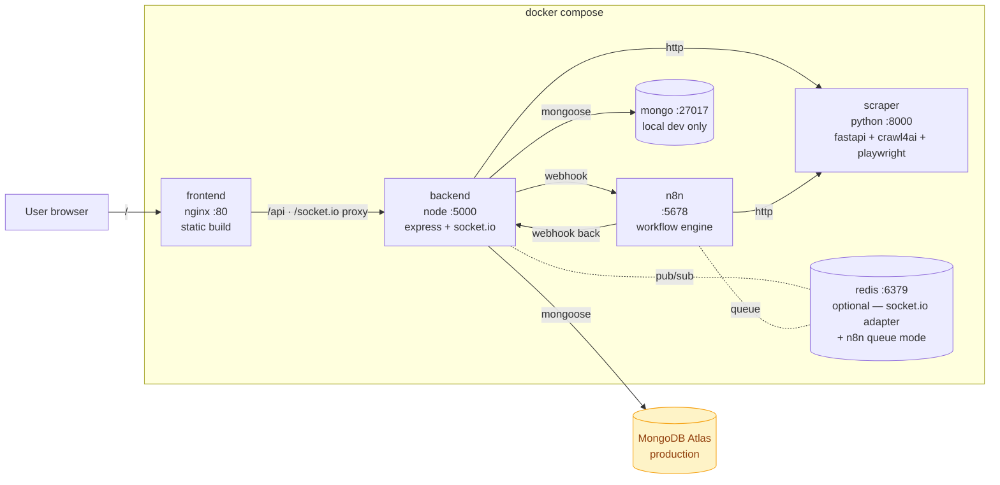
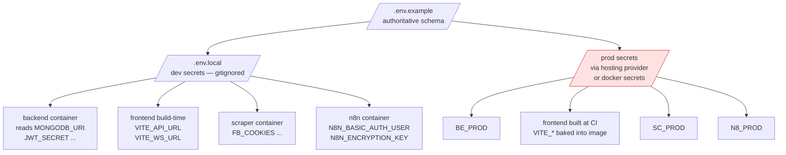
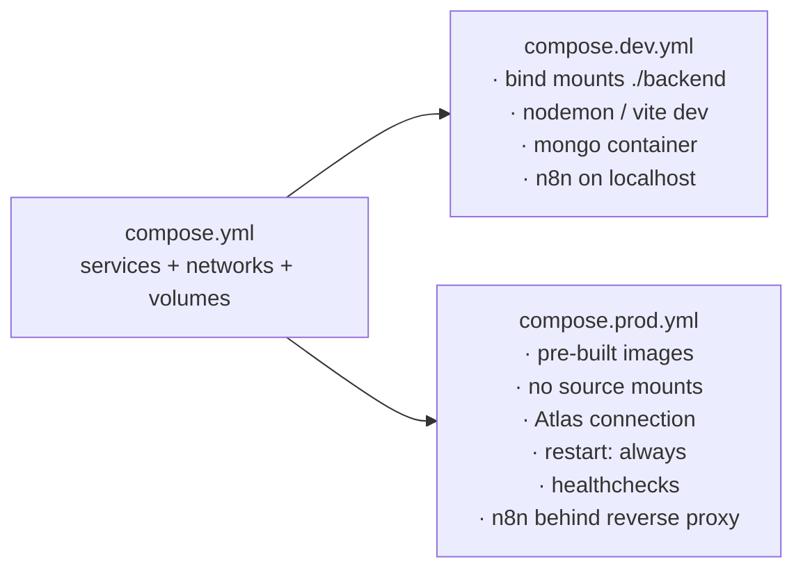
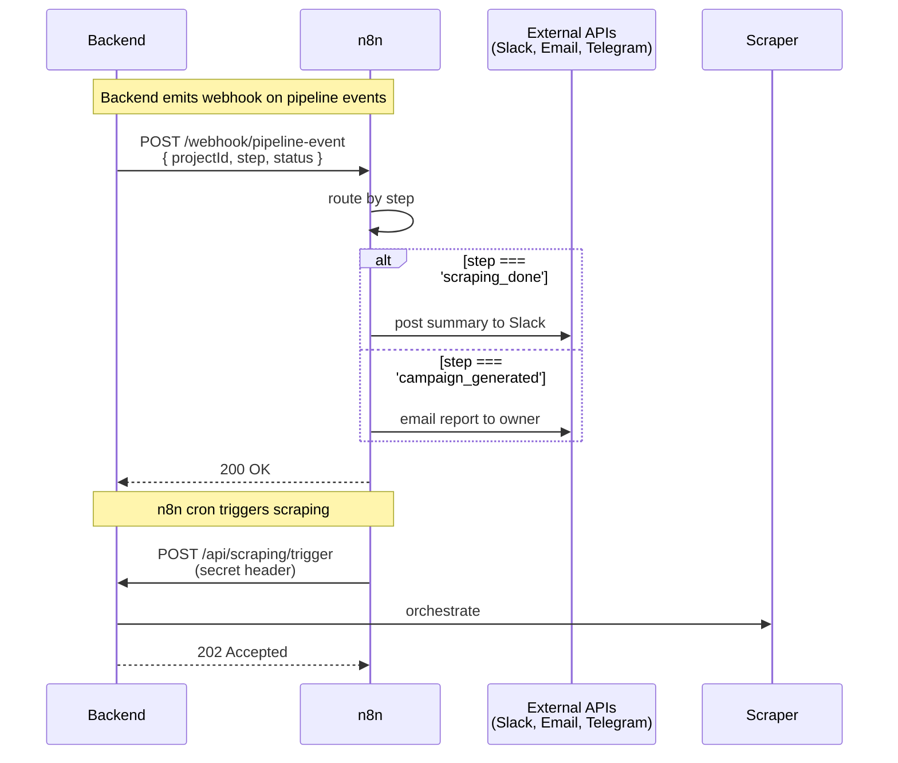
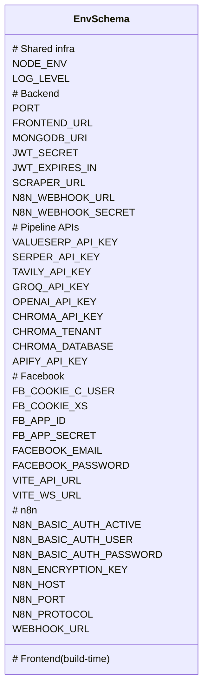

# Sprint 03 — Containerization + n8n + Env Parity

> **Goal:** Ship the full stack as a reproducible **Docker Compose** solution (backend · frontend · Python scraper · MongoDB · n8n), with a disciplined **.env** strategy so **local dev** and **production** run from the same compose definitions but differ only in an env layer.

---

## 1. Sprint intent

Today the project runs three processes the user has to boot by hand (`npm run dev` for backend, `npm run dev` for frontend, `uvicorn` for the Python scraper) — plus cloud MongoDB Atlas. That's fragile:

- Onboarding a new dev means installing Node, Python, Playwright browsers, and juggling secrets.
- There's no single `up` command to reproduce the system.
- Production deployment has no artifact — it would re-derive everything from `git pull` on the host.
- Secrets are scattered across `backend/.env` with no documented contract.

This sprint delivers:

1. A **single `docker compose up`** that runs the whole stack locally.
2. One production compose overlay that uses pre-built images and external secrets.
3. **n8n** as a workflow-automation sidecar — triggers scraping, schedules reports, fans out notifications — without us writing more cron plumbing.
4. **Env parity** via one authoritative `.env.example` at the repo root, per-service inheritance, and a documented prod/local diff.

---

## 2. Target topology

### 2.1 Container layout



In **local dev** the `mongo` container is used; in **production** the Atlas connection string is injected and the `mongo` service is excluded via a profile.

### 2.2 Env layering



**Rule:** one schema (`.env.example`), many environments. If a var exists in prod, it must exist in `.env.example`. CI fails the build if a variable is referenced in compose but undefined in the schema.

### 2.3 Dev vs prod compose overlay



Invocation:

```bash
docker compose -f compose.yml -f compose.dev.yml up         # local
docker compose -f compose.yml -f compose.prod.yml up -d     # production
```

---

## 3. Why n8n

n8n is a low-code workflow runner. It fits three needs we'd otherwise hand-build:

| Need | Without n8n | With n8n |
|---|---|---|
| Schedule daily scraping | `node-cron` inside backend (already present, fragile — dies with the process) | n8n cron node → HTTP → `/api/scraping/run` |
| Notify on campaign complete | Bespoke email/Slack/Telegram code | n8n **Webhook → Slack/Email/Discord** nodes |
| Enrich competitor data via 3rd-party | Custom code per integration | n8n has 400+ pre-built integrations |
| Pipeline orchestration (step1 → step2 → …) | Hand-rolled in `project.controller.js` | Visual workflow, retries + error branches |

### 3.1 Integration pattern



n8n reaches backend over the internal compose network via `http://backend:5000`, so no public exposure of internal endpoints is required.

---

## 4. Task breakdown

### Epic A — Repo restructure + env schema

| ID | Task | Deliverable | Est. |
|---|---|---|---|
| A1 | Audit all `process.env.*` reads across backend + scraper + frontend; produce exhaustive variable list | spreadsheet / markdown table | 1h |
| A2 | Author `.env.example` at repo root with every var, grouped, documented with inline comments | single source of truth | 1.5h |
| A3 | Add `.env` / `.env.local` to `.gitignore` if not already; verify no secret committed | clean git history | 0.5h |
| A4 | Split backend env consumption so all reads go through `src/config/env.js` (already mostly done) | no stray `process.env.XXX` outside config | 1h |
| A5 | Document env contract in `designDocs/03_sprint_intention/env_reference.md` | reference doc | 1h |

### Epic B — Backend container

| ID | Task | Deliverable | Est. |
|---|---|---|---|
| B1 | `backend/Dockerfile` — multi-stage (deps → runtime), node:20-alpine, non-root user | reproducible image | 1h |
| B2 | `.dockerignore` — exclude `node_modules`, `.env`, logs, scraper dir | smaller context | 0.25h |
| B3 | Healthcheck: `GET /api/health` via `wget` or `node -e` inside container | liveness probe | 0.5h |
| B4 | Expose `:5000`, document CORS / `FRONTEND_URL` for container-network origin | works inside compose | 0.5h |

### Epic C — Frontend container

| ID | Task | Deliverable | Est. |
|---|---|---|---|
| C1 | `frontend/Dockerfile` — two stages: **build** (`node:20-alpine` runs `npm ci && npm run build`) → **serve** (`nginx:alpine` with custom conf) | static image | 1h |
| C2 | `frontend/nginx.conf` — serve SPA (fallback to `index.html`), proxy `/api` + `/socket.io` to `http://backend:5000` | routing works | 1h |
| C3 | Handle `VITE_*` at build-time via `ARG`s passed from compose | env baked at build | 0.5h |
| C4 | Dev-mode variant: run Vite dev server directly (HMR) in `compose.dev.yml` instead of nginx image | hot reload | 0.5h |

### Epic D — Python scraper container

| ID | Task | Deliverable | Est. |
|---|---|---|---|
| D1 | `backend/src/scraper/Dockerfile` — base `mcr.microsoft.com/playwright/python:v1.47.0-jammy` (Chromium + OS deps preinstalled) | works without host Playwright | 1.5h |
| D2 | `backend/src/scraper/requirements.txt` — pin fastapi, uvicorn, crawl4ai, beautifulsoup4, pydantic | reproducible | 0.5h |
| D3 | Compose service calls `uvicorn scraper_service:app --host 0.0.0.0 --port 8000` | reachable at `http://scraper:8000` | 0.25h |
| D4 | Backend calls scraper via env `SCRAPER_URL=http://scraper:8000` (default in compose) | DNS works | 0.25h |
| D5 | Persistent volume for scraper cache / cookies (so we don't re-login FB every restart) | volume mount | 0.5h |

### Epic E — n8n service

| ID | Task | Deliverable | Est. |
|---|---|---|---|
| E1 | Add `n8nio/n8n:latest` service on `:5678` | container running | 0.25h |
| E2 | Persistent volume for workflows + credentials (`~/.n8n` → named volume `n8n_data`) | workflows survive restarts | 0.25h |
| E3 | Configure `N8N_BASIC_AUTH_USER` / `N8N_BASIC_AUTH_PASSWORD` via env | UI protected | 0.25h |
| E4 | Set `N8N_ENCRYPTION_KEY` (random secret) — required for credential encryption | no plain-text creds | 0.25h |
| E5 | In backend, add a small webhook emitter (`src/services/n8n.notify.js`) that POSTs to `${N8N_WEBHOOK_URL}/pipeline-event` on key events | backend → n8n channel | 1h |
| E6 | In backend, protect the webhook endpoint `/api/webhooks/n8n` with a shared secret header (`X-N8N-Signature`) | only n8n can trigger | 1h |
| E7 | Seed two starter workflows: (1) daily scraping cron, (2) Slack notification on `campaign_generated` | importable JSON in `infra/n8n/workflows/` | 2h |

### Epic F — Mongo (local) + Redis (optional)

| ID | Task | Deliverable | Est. |
|---|---|---|---|
| F1 | `mongo:7` service on `:27017` — **behind a compose profile** `local-db` so prod doesn't spin it up | `docker compose --profile local-db up` | 0.5h |
| F2 | Persistent volume `mongo_data` | DB survives restarts | 0.25h |
| F3 | Compose `MONGODB_URI=mongodb://mongo:27017/pfe_marketing` in dev overlay | backend connects | 0.25h |
| F4 | `redis:7-alpine` service also gated by profile `with-redis` | optional | 0.5h |
| F5 | Document in README when to enable each profile | ops clarity | 0.25h |

### Epic G — Compose orchestration

| ID | Task | Deliverable | Est. |
|---|---|---|---|
| G1 | `compose.yml` — base: all services, networks, volumes (no build flags forced) | foundation | 1h |
| G2 | `compose.dev.yml` — bind-mount source, override commands to `npm run dev` / `uvicorn --reload`, expose ports on host | dev workflow | 1h |
| G3 | `compose.prod.yml` — `restart: always`, healthchecks, `pull_policy: always`, no host port exposure for backend/scraper (only via reverse proxy) | prod-ready | 1h |
| G4 | Root `Makefile` or `package.json` scripts (`make dev`, `make prod`, `make seed`, `make logs`) — thin wrappers over compose commands | ergonomic | 0.5h |
| G5 | Internal compose network `pfe_net` — all services attached; only `frontend` publishes :80 to host in prod | defence in depth | 0.5h |

### Epic H — CI / build artifacts (stretch)

| ID | Task | Deliverable | Est. |
|---|---|---|---|
| H1 | GitHub Actions: on push to `main`, build backend + frontend + scraper images, tag with commit SHA, push to registry | automated images | 2h |
| H2 | `docker compose config` validation step in CI catches missing env vars | shift-left failure | 0.5h |
| H3 | Optional: scan images with Trivy for CVEs | security baseline | 0.5h |

**Total estimate:** ~25 hours (~3 working days). Epic H (CI) is stretch — can slip without blocking the rest.

---

## 5. Env reference (to be finalized in `env_reference.md`)



### 5.1 Dev vs prod diff

| Variable | Local dev | Production |
|---|---|---|
| `NODE_ENV` | `development` | `production` |
| `MONGODB_URI` | `mongodb://mongo:27017/pfe_marketing` | Atlas SRV string |
| `FRONTEND_URL` | `http://localhost:5173` | `https://app.example.com` |
| `VITE_API_URL` | `/api` (via Vite proxy) | `https://app.example.com/api` |
| `VITE_WS_URL` | `http://localhost:5000` | `https://app.example.com` |
| `SCRAPER_URL` | `http://scraper:8000` | `http://scraper:8000` (same — internal net) |
| `N8N_WEBHOOK_URL` | `http://n8n:5678/webhook` | `http://n8n:5678/webhook` (internal) |
| `N8N_ENCRYPTION_KEY` | generated once, committed to `.env.local` | vault-managed; rotate annually |
| `JWT_SECRET` | dev-only string | 64-byte random, vault-managed |
| All Playwright/FB cookies | present in dev | **per-environment** — prod may use a dedicated scraping account |

---

## 6. Compose file layout (reference)

```
pfe_marketing_agent11/
├── compose.yml                     # base (all services)
├── compose.dev.yml                 # dev overlay
├── compose.prod.yml                # prod overlay
├── .env.example                    # authoritative schema
├── .env.local                      # dev secrets (gitignored)
├── Makefile                        # shortcuts
├── backend/
│   ├── Dockerfile
│   ├── .dockerignore
│   └── src/
├── frontend/
│   ├── Dockerfile
│   ├── nginx.conf
│   ├── .dockerignore
│   └── src/
└── infra/
    ├── n8n/
    │   └── workflows/
    │       ├── daily-scraping.json
    │       └── campaign-notifications.json
    └── mongo/
        └── init.js                 # optional: create indexes / seed admin
```

---

## 7. Risks & trade-offs

| Risk | Mitigation |
|---|---|
| Playwright + Crawl4AI image is heavy (~1.5 GB) | Use MS official Playwright base image; only pull once; cache layers aggressively in CI |
| Secret sprawl — multiple `.env*` files is confusing | CI check: every var in compose must appear in `.env.example`; lint step catches drift |
| n8n workflows contain credentials | Encrypted at rest via `N8N_ENCRYPTION_KEY`; workflow JSONs in git have creds stripped (use n8n's export without credentials) |
| `mongo` container in prod accidentally | Gated behind `profiles: [local-db]`; prod compose doesn't enable the profile |
| Socket.IO sticky sessions when scaling backend | Add Redis adapter via compose profile `with-redis`; out-of-scope here but documented |
| Vite dev proxy vs nginx routing divergence | `nginx.conf` and `vite.config.ts` share the same proxy rules (`/api`, `/socket.io`) — keep both reviewed in the same PR |
| Scraper FB cookies expire | Volume-mount `~/.scraper-state`; re-run the manual login flow when expired (no automated solution this sprint) |

---

## 8. Definition of Done

- [ ] `cp .env.example .env.local` + fill secrets → `docker compose -f compose.yml -f compose.dev.yml --profile local-db up` brings the entire stack up with one command.
- [ ] Frontend reachable at `http://localhost:5173` (dev) or `http://localhost` (prod-like).
- [ ] Backend reachable from the frontend via proxy; Socket.IO handshake succeeds.
- [ ] Scraper microservice reachable from backend at `http://scraper:8000` inside compose.
- [ ] n8n UI reachable at `http://localhost:5678`, basic-auth protected.
- [ ] A sample n8n workflow (daily scraping cron) is imported and active.
- [ ] `npm run seed` still works end-to-end inside the compose network.
- [ ] `docker compose -f compose.yml -f compose.prod.yml config` produces valid YAML with no undefined vars.
- [ ] `.env.example` is the only authoritative schema; CI validates no drift.
- [ ] README updated with a `## Running with Docker` section covering all three modes (dev, prod, seed).

---

## 9. Follow-up (not in scope)

- **Sprint 04:** Kubernetes manifests (Helm chart) — compose is the MVP, k8s is the scale story.
- Reverse proxy (Caddy / Traefik) with automatic TLS for the prod overlay.
- Observability: Prometheus exporters for backend + n8n, Grafana dashboards.
- Image signing + SBOM generation in CI (`cosign`, `syft`).
- Move Python scraper from a sidecar microservice to an n8n custom node (eliminates the extra service).
