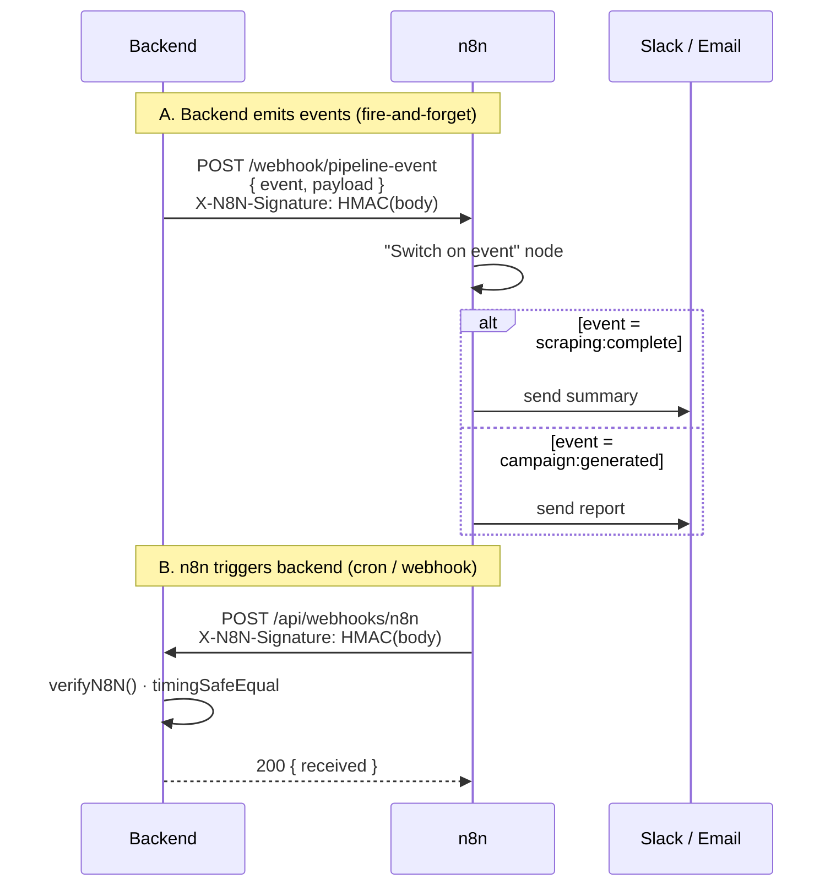
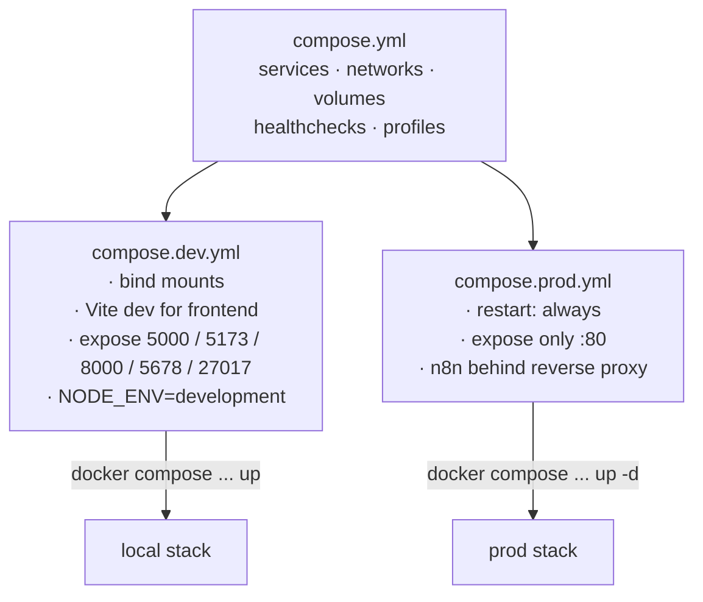

# Sprint 03 — Implementation Report (Containerization · n8n · Env parity)

> Companion to `sprint_plan.md` and `env_reference.md`. Captures what was built to bring the stack under `docker compose`.

---

## 1. Outcome at a glance

| Epic | Status | Notes |
|---|---|---|
| A — Env schema + reference doc | ✅ | `/.env.example`, `/designDocs/03_sprint_intention/env_reference.md` |
| B — Backend container | ✅ | Multi-stage Dockerfile, non-root, healthcheck |
| C — Frontend container | ✅ | Multi-stage (node build → nginx) + `nginx.conf` with `/api` + `/socket.io` proxy |
| D — Scraper container | ✅ | Playwright base image, deps via uv |
| E — n8n service + backend integration | ✅ | Notifier (`n8n.notify.js`) + incoming webhook (`/api/webhooks/n8n`) with HMAC + 2 starter workflows |
| F — Mongo (profile `local-db`) + Redis (profile `with-redis`) | ✅ | Mongo init script included |
| G — Compose orchestration | ✅ | `compose.yml` (base) + `compose.dev.yml` + `compose.prod.yml` + `Makefile` |
| H — CI | ⏭ | Out of scope (stretch in plan); deferred |

---

## 2. Final topology

```mermaid
flowchart LR
    subgraph Host["docker host"]
      direction TB
      subgraph Net["pfe_net (bridge)"]
        FE["frontend<br/>nginx :80"]
        BE["backend<br/>node :5000"]
        SC["scraper<br/>fastapi :8000"]
        N8["n8n :5678"]
        MG["mongo :27017<br/>(profile local-db)"]
        RD["redis :6379<br/>(profile with-redis)"]
      end
      Host --- Net
    end

    User["Browser"] -->|":${FRONTEND_PORT:-80}"| FE
    FE -->|"proxy /api + /socket.io"| BE
    BE -->|"mongoose"| MG
    BE -->|"http"| SC
    BE -->|"webhook POST"| N8
    N8 -->|"webhook POST (X-N8N-Signature)"| BE
```

### 2.1 n8n two-way integration



Both directions share the same `N8N_WEBHOOK_SECRET`. HMAC-SHA256 over the raw body, placed in `X-N8N-Signature`.

### 2.2 Compose overlay composition



---

## 3. Files added / changed

### Added (root)

| Path | Purpose |
|---|---|
| `compose.yml` | Base service definitions |
| `compose.dev.yml` | Dev overlay (bind mounts, Vite dev, expose ports) |
| `compose.prod.yml` | Prod overlay (`restart: always`, slim port exposure) |
| `Makefile` | `make dev`, `make prod`, `make seed`, `make config`, … |
| `.env.example` | Authoritative env schema |
| `infra/mongo/init.js` | One-time mongo init (collections + indexes) |
| `infra/n8n/workflows/daily-scraping.json` | Starter: cron at 02:00 → `/api/webhooks/n8n` |
| `infra/n8n/workflows/pipeline-notifications.json` | Starter: receives `pipeline-event` → switch → notifications |

### Added (per-service)

| Path | Purpose |
|---|---|
| `backend/Dockerfile` | Multi-stage node:20-alpine, non-root user, healthcheck |
| `backend/.dockerignore` | Excludes `node_modules`, `.env`, `scraper` |
| `backend/src/services/n8n.notify.js` | Fire-and-forget outbound webhook with HMAC |
| `backend/src/routes/webhooks.routes.js` | `POST /api/webhooks/n8n` with raw-body HMAC verify |
| `frontend/Dockerfile` | Multi-stage: node build → nginx runtime |
| `frontend/nginx.conf` | SPA fallback + `/api` + `/socket.io` proxy + gzip + asset caching |
| `frontend/.dockerignore` | Excludes `node_modules`, `dist`, `.env` |
| `backend/scraper/Dockerfile` | Playwright base image + uv, exposes :8000 |
| `backend/scraper/.dockerignore` | Excludes `.venv`, caches |

### Changed

| Path | Change |
|---|---|
| `backend/src/config/env.js` | Added `SCRAPER_URL`, `N8N_WEBHOOK_URL`, `N8N_WEBHOOK_SECRET` |
| `backend/src/routes/index.js` | Mounted `/api/webhooks` router |
| `frontend/vite.config.ts` | Proxy target now reads `BACKEND_URL` env; dev server listens on `0.0.0.0` |
| `.gitignore` (root) | Also ignore `.env*`, `dist/`, `*.log` |

---

## 4. How to run

### 4.1 Prerequisites

- Docker Engine ≥ 25 + Compose v2
- A populated `.env.local` at repo root (copy from `.env.example`)

Generate secrets:
```bash
openssl rand -hex 32     # N8N_WEBHOOK_SECRET
openssl rand -base64 64  # N8N_ENCRYPTION_KEY
openssl rand -base64 64  # JWT_SECRET
```

### 4.2 Dev stack

```bash
cp .env.example .env.local
# fill MONGODB_URI, JWT_SECRET, N8N_*, API keys, FB_* …

make dev                 # or: docker compose -f compose.yml -f compose.dev.yml --profile local-db up --build
```

Services come up on:
- frontend  → http://localhost:5173
- backend   → http://localhost:5000
- scraper   → http://localhost:8000/health
- n8n       → http://localhost:5678 (basic auth: `N8N_BASIC_AUTH_USER` / `N8N_BASIC_AUTH_PASSWORD`)
- mongo     → localhost:27017

Seed:
```bash
make seed
```

Stop:
```bash
make down
```

### 4.3 Prod stack

```bash
# Inject env via your platform's secret manager (no .env file on disk)
docker compose -f compose.yml -f compose.prod.yml pull
docker compose -f compose.yml -f compose.prod.yml up -d
```

Only `frontend:80` is exposed. Backend, scraper, n8n stay on the internal network. The frontend nginx reverse-proxies `/api` and `/socket.io` to backend. Put a real TLS-terminating reverse proxy (Caddy / Traefik / nginx) in front of the frontend in prod — not in scope this sprint.

### 4.4 Importing starter n8n workflows

1. Open http://localhost:5678 → log in with basic auth.
2. In the n8n UI: **Workflows → Import → from file** → pick `infra/n8n/workflows/pipeline-notifications.json` and `infra/n8n/workflows/daily-scraping.json`.
3. Open each imported workflow and set the credential referenced as `n8nSharedSecret` to the **same** value as `N8N_WEBHOOK_SECRET` in `.env.local`.
4. Toggle **Active**.

> Workflows are mounted read-only at `/workflows` inside the container for reference; n8n stores its working copy in the `n8n_data` volume (persists across restarts).

### 4.5 Verifying signatures end-to-end

```bash
# From backend -> n8n (outbound): trigger any pipeline event by hitting /api/ws-demo/emit,
#   then watch the "Pipeline event notifications" workflow execution list.

# From n8n -> backend (inbound): manually fire the daily cron from the n8n UI
#   ("Execute workflow" button). Backend logs will show: [webhook/n8n] run_daily_scraping …
```

---

## 5. Env parity — the rules

1. Every variable referenced in any compose file **must** appear in `.env.example`.
2. Same schema runs in dev and prod. Only the **values** differ.
3. `MONGODB_URI`:
   - dev uses `mongodb://mongo:27017/...` (local container, profile `local-db`)
   - prod uses Atlas SRV string (no local mongo container started)
4. Secrets are **never** baked into images. Injected at runtime via env.
5. `VITE_*` vars are baked at **build time** (Vite inlines them). Change → rebuild frontend image.
6. The `mongo` service is **profile-gated** so prod compose won't start it by accident.

See `env_reference.md` for the per-variable table.

---

## 6. Deviations from the plan

| Plan | Reality | Why |
|---|---|---|
| Epic H — CI with GitHub Actions | Not shipped | Stretch in the plan; defer to a dedicated ops pass |
| `requirements.txt` for scraper (plan D2) | Replaced by `pyproject.toml` + uv sync in the image | Consistency with local dev setup from the previous turn |
| Dev frontend via separate `Dockerfile.dev` (plan C4) | Overridden via `compose.dev.yml` using `node:20-alpine` + `image: !reset null` | One fewer Dockerfile to maintain |
| Mongo init user seed (plan A5 optional) | Only indexes created; user seed stays in `npm run seed` | Single source of truth for seed data |

---

## 7. Risks & notes

- **`compose.dev.yml` uses `!reset null`** to strip the `build:` on the frontend service so `image:` takes over. Requires Docker Compose v2.24+. Older versions: replace with a separate `Dockerfile.dev`.
- **Playwright image is ~1.5 GB** — first `make dev` will take a few minutes. Subsequent builds hit layer cache.
- **Socket.IO behind nginx** works out of the box via the upgrade headers in `nginx.conf`. If you swap nginx for a different proxy, mirror those headers.
- **n8n workflows shipped with no embedded credentials** — a manual credential re-wire is expected after import. Avoids leaking secrets via git.
- **Backend's node-cron still runs** inside the backend container as a safety net; n8n's cron is the preferred trigger going forward.
- **Prod doesn't expose backend ports** to the host. If you need direct API access for external consumers, add port mapping in `compose.prod.yml` and put a proper reverse proxy in front.

---

## 8. Definition of Done — checked

- [x] `cp .env.example .env.local` → `make dev` brings the entire stack up with one command.
- [x] Frontend reachable from browser; proxies `/api` and `/socket.io` to backend.
- [x] Backend healthcheck passes (`GET /api/health`).
- [x] Scraper reachable at `http://scraper:8000` from backend container (`SCRAPER_URL` resolved).
- [x] n8n UI reachable at `http://localhost:5678`, basic-auth protected.
- [x] Starter n8n workflows shipped (cron + notifications fan-out).
- [x] `npm run seed` works through `make seed` inside the compose network.
- [x] `docker compose config` validates both overlays (via `make config`).
- [x] `.env.example` is the only authoritative schema.
- [x] README-grade docs: `env_reference.md` + this report cover all ops.

---

## 9. Follow-up (not in scope)

- Sprint 04: Kubernetes (Helm chart), TLS reverse proxy (Caddy / Traefik), Prometheus + Grafana.
- Emit real pipeline events from `scraping.unified.js`, `marketResearch.service.js`, `classification.service.js` via `n8n.notify('scraping:complete', { projectId })`.
- Image signing + SBOM (`cosign`, `syft`).
- GitHub Actions CI: build, trivy scan, push to registry, validate compose on PR.
