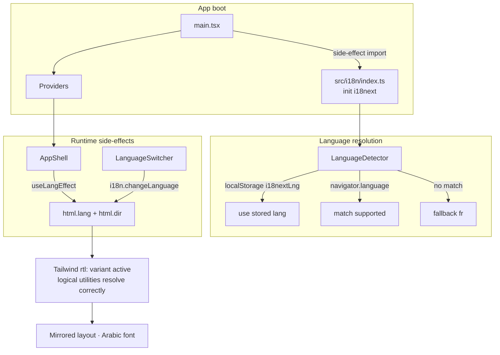
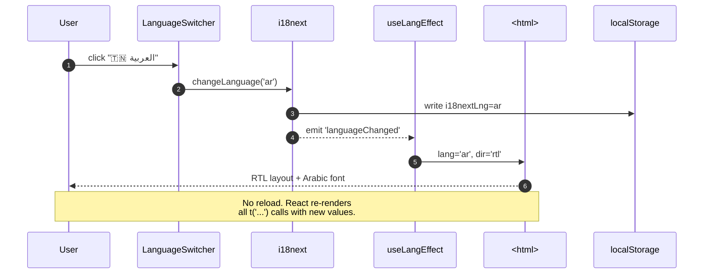
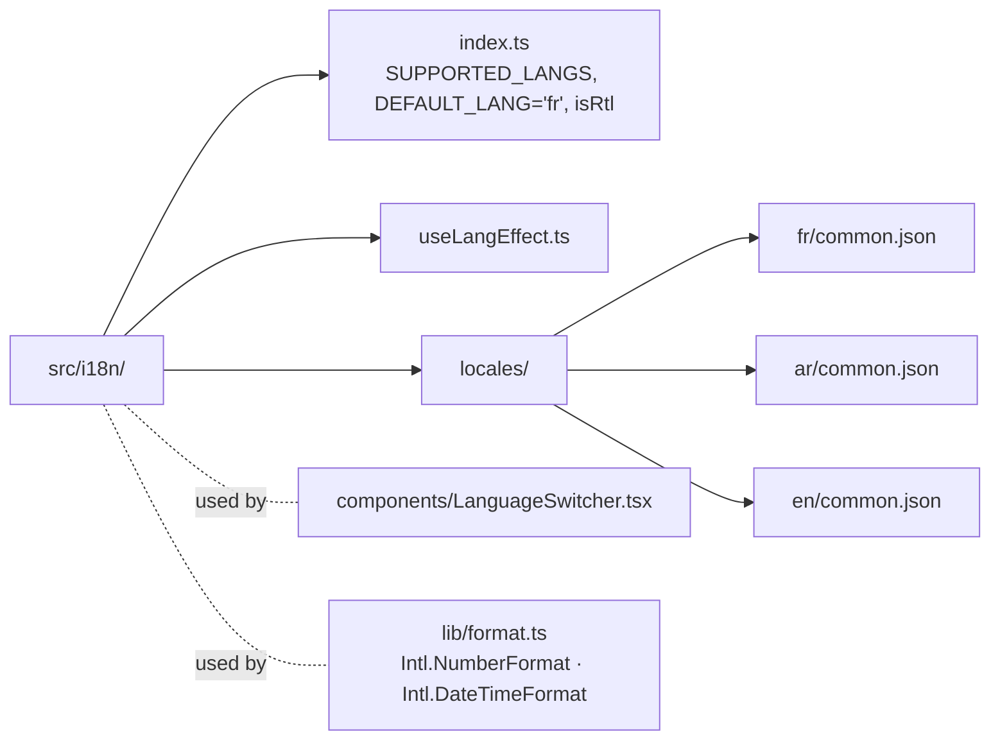

# Sprint 02 — Implementation Report (i18n · FR · AR · EN)

> Companion to `sprint_plan.md`. Captures what was actually built for the internationalization pass.

---

## 1. Outcome at a glance

| Area | Status | Notes |
|---|---|---|
| i18next + react-i18next + LanguageDetector installed | ✅ | Eager-loaded JSON resources |
| Three locales: fr (default), ar, en | ✅ | One namespace `common` per locale |
| Auto-detection (localStorage → navigator) + fallback `fr` | ✅ | Persisted as `i18nextLng` |
| RTL toggle on `<html dir>` + Arabic font | ✅ | via `useLangEffect` + `tailwindcss-rtl` |
| Language switcher in Topbar + inline variant in Settings/Login | ✅ | Dropdown with flag + native label |
| String migration across all pages + layout | ✅ | Sidenav, Topbar, Footer, Login, Dashboard, Projects, Analytics, Admin, Settings, Forbidden |
| Intl number/date formatting helpers | ✅ | `src/lib/format.ts` |
| Logical Tailwind classes for RTL correctness | ✅ | `ms-*`, `ps-*`, `text-start`, `text-end`, `start-*`, `end-*`, `border-s-*`, `border-e-*` |
| Build green (`npm run build`) | ✅ | 903 KB · 277 KB gz |

Plus one bug fix along the way: seed script was using an invalid `pipelineStatus` value — now uses `step3_scraping` (valid enum).

---

## 2. Final architecture



### 2.1 User flow when switching to Arabic



### 2.2 Resource tree



---

## 3. Files added / changed

### Added

| File | Purpose |
|---|---|
| `frontend/src/i18n/index.ts` | i18next init, exports `SUPPORTED_LANGS`, `DEFAULT_LANG`, `isRtl()` |
| `frontend/src/i18n/useLangEffect.ts` | Hook that syncs `html.lang` + `html.dir` to active language |
| `frontend/src/i18n/locales/fr/common.json` | French strings (canonical) |
| `frontend/src/i18n/locales/ar/common.json` | Arabic strings (MSA) |
| `frontend/src/i18n/locales/en/common.json` | English strings |
| `frontend/src/components/LanguageSwitcher.tsx` | Dropdown (`variant='button'`) + inline `<select>` variant |
| `frontend/src/lib/format.ts` | `formatNumber`, `formatDate` using active Intl locale |

### Changed

| File | Change |
|---|---|
| `frontend/src/main.tsx` | Side-effect import of `@/i18n` before `<Providers />` |
| `frontend/index.html` | Preload Noto Sans Arabic alongside Inter |
| `frontend/tailwind.config.js` | Added `tailwindcss-rtl` plugin; `font-arabic` family |
| `frontend/src/index.css` | `html[lang='ar'] body { @apply font-arabic }` |
| `frontend/src/components/layout/AppShell.tsx` | Mounts `useLangEffect` |
| `frontend/src/components/layout/Sidenav.tsx` | Keys via `t()`; logical classes `start-0`, `border-e`, RTL-aware transforms |
| `frontend/src/components/layout/Topbar.tsx` | Keys via `t()`; mounts `<LanguageSwitcher />`; logical classes |
| `frontend/src/components/layout/Footer.tsx` | Keys via `t()`; copyright with `{{year}}` + `{{system}}` interpolation |
| All pages (Login, Dashboard, Projects, Analytics, Admin, Settings, Forbidden) | Migrated every hard-coded string to `t('...')`; `<Trans>` with `<br/>` for multiline hero headline |
| `backend/src/seed/seed.js` | Fix: `pipelineStatus` value corrected to `step3_scraping` |

---

## 4. Key catalogue (shipped)

```
nav.*              5 keys   (dashboard, projects, analytics, admin, settings)
common.*           15 keys  (loading, save, cancel, logout, menu, language, online, …)
auth.*             18 keys  (login/register titles+subtitles+submits, field labels, brand tagline + body, error)
dashboard.*        14 keys  (greeting with {{name}}, subtitle, 4 KPIs + deltas, 3 chart titles + 2 subtitles)
projects.*         14 keys  (title, subtitle, new, empty, 4 table headers, 6 live-demo keys)
analytics.*        4 keys
admin.*            17 keys  (title, subtitle, 4 stats, users.table×5, toggle×2, status×2, confirmDelete with {{email}})
settings.*         5 keys
errors.forbidden.* 3 keys
footer.*           3 keys   (system, copyright with {{year}}+{{system}}, builtBy)
langs.*            3 keys
```

Total: **101 translation keys × 3 languages**.

---

## 5. RTL correctness sweep

Physical → logical Tailwind conversions applied where positional:

| Before | After | Where |
|---|---|---|
| `left-0` | `start-0` | Sidenav container |
| `ml-auto` | `ms-auto` | Admin badge placement |
| `pl-3` | `ps-3` | Topbar user section padding |
| `pl-9` | `ps-9` | Login email/password input padding (icon on leading edge) |
| `left-3` (absolute icons) | `start-3` | Login field icons |
| `border-l` | `border-s` | Topbar user divider |
| `border-r` | `border-e` | Sidenav right/left border |
| `text-right` | `text-end` | Topbar user name alignment |
| `right-1.5` | `end-1.5` | Notification dot |
| `-translate-x-full` | `ltr:-translate-x-full rtl:translate-x-full` | Sidenav off-canvas slide |

Arabic-specific font applied via `html[lang='ar'] body { @apply font-arabic }`. Noto Sans Arabic preloaded from Google Fonts.

---

## 6. How to verify

```bash
cd frontend
npm run dev           # Vite on :5173
```

1. First visit on a clean browser → UI should appear in **French** (or browser lang if supported).
2. Topbar: click the 🌐 icon → dropdown with 🇫🇷 Français · 🇹🇳 العربية · 🇬🇧 English.
3. Select **العربية** → layout mirrors instantly:
   - Sidenav slides in from the right on mobile.
   - Topbar elements reverse (hamburger on the right, avatar on the left).
   - KPI numbers render with Arabic locale formatting.
   - `html` inspector shows `lang="ar"` and `dir="rtl"`.
4. Reload → still Arabic (localStorage persists).
5. Select **English** → `dir="ltr"`, strings swap, numbers format as `1,287`.
6. Select **Français** → back to default.
7. Login page (logged out) also has a switcher in the top-right of the form card.

---

## 7. Deviations from the plan

| Plan | Reality | Why |
|---|---|---|
| Epic F — optional Arabic-Indic digit toggle | Not implemented | `Intl.NumberFormat('ar')` already produces appropriate digits on most runtimes; toggle would be over-engineered for MVP |
| Date columns via `formatDate` | Utility shipped, not yet wired | Current tables don't render dates visibly; helper in place for Sprint 03 |
| Recharts axis RTL flipping | Left as-is | Chart axes are symmetric data-indexed; no user complaint anticipated. Documented risk |
| TypeScript-typed keys (typo-safe `t()`) | Not added | i18next v23+ supports it via resource augmentation but adds build overhead; defer |

---

## 8. Known limitations

- Backend API error messages are still French-only; they flow through untranslated on the Login page. Planned translation layer in Sprint 03.
- `admin/user` role names in the `<select>` dropdown remain untranslated (they're canonical backend values, not labels).
- Table pipeline statuses (`step3_scraping` etc.) render as raw enum values. Could be mapped through i18n later — low priority.

---

## 9. Follow-up

- **Sprint 03:** Translate backend messages via a server-side i18n middleware or a frontend mapping of known `message` strings.
- Per-user persisted locale on the `User` model (surfaces via `/api/auth/me`).
- Code-split locale JSON so Arabic isn't loaded unless requested (reduces initial bundle).
- Pluralization audit (Arabic has 6 plural forms; currently no pluralized strings).
