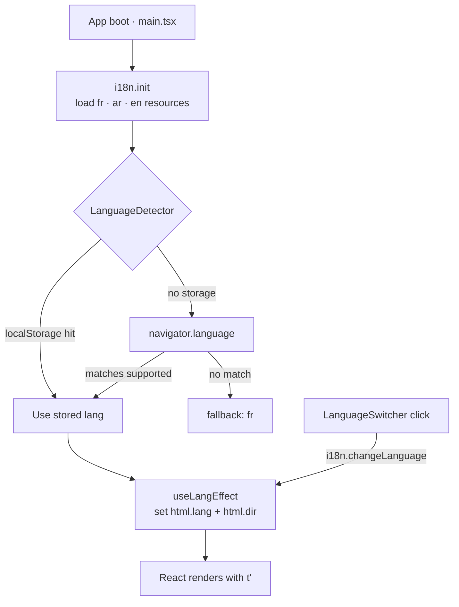
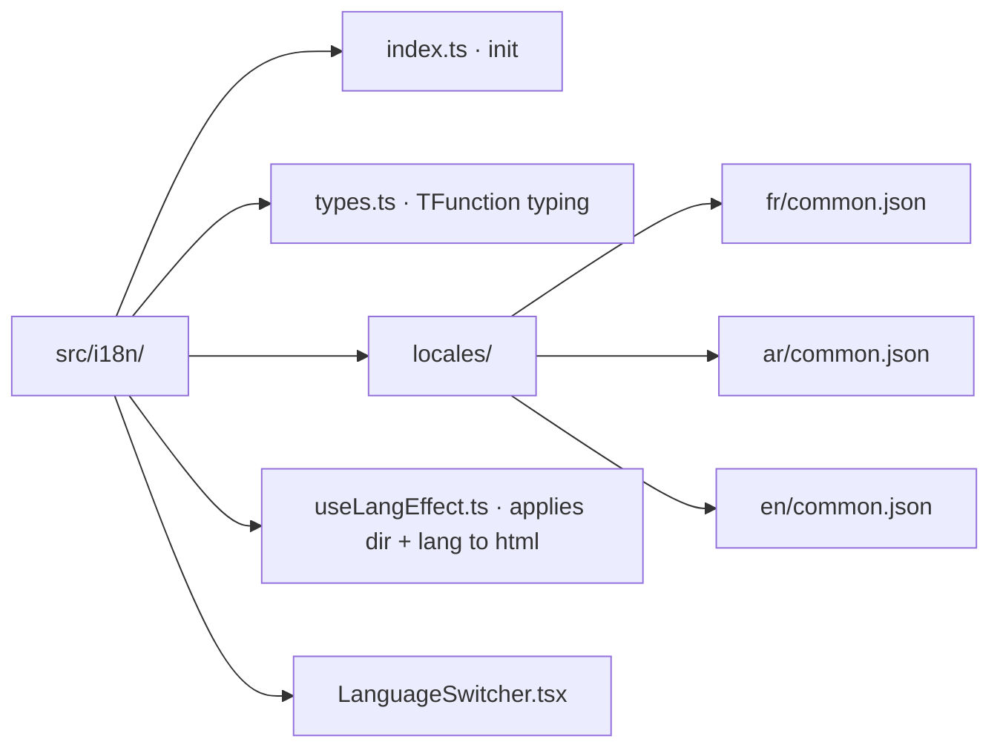
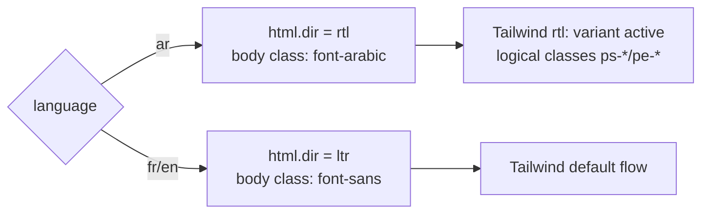
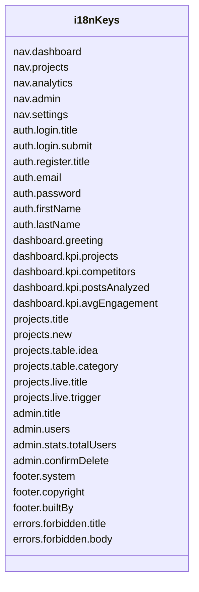

# Sprint 02 — Internationalization (FR · AR · EN)

> **Goal:** Make the frontend fully multilingual with **French as the default**, plus **Arabic (RTL)** and **English** support — including language detection, persistence, and right-to-left layout switching for Arabic.

---

## 1. Sprint intent

The target market is **Tunisia** (per `specification.md`) — a French-first audience with heavy Arabic and English mixing. Hard-coding French strings is a non-starter. This sprint delivers:

1. A single translation layer (react-i18next) accessible from any component.
2. Three locales shipped at build time: **fr** (default), **ar**, **en**.
3. Automatic browser-language detection on first visit, with user override persisted to `localStorage`.
4. True RTL for Arabic — `<html dir="rtl">`, logical layout classes, mirrored Sidenav drawer, correct number/date formatting.
5. A language switcher in the Topbar that hot-swaps the UI with no reload.

Out of scope: translating backend error messages, translating user-generated content (business ideas stay as typed).

---

## 2. Architecture

### 2.1 Runtime flow

### 2.2 Resource layout

Single namespace (`common`) for now — split if files grow past ~500 lines.

### 2.3 RTL handling

Approach:
- **Direction** — toggle `document.documentElement.dir` on lang change.
- **Tailwind** — `tailwindcss-rtl` plugin enables the `rtl:` variant; switch physical classes (`ml-*`, `pl-*`, `left-*`, `rounded-l-*`) to logical ones (`ms-*`, `ps-*`, `start-*`, `rounded-s-*`) where positional correctness matters.
- **Icons** — react-icons' directional icons (chevrons, arrows) get a `rtl:rotate-180` utility; most Fi icons (menu, bell, user) are symmetric and need nothing.
- **Fonts** — ship Noto Sans Arabic (Google Fonts) alongside Inter; Tailwind `font-arabic` utility applied via `html[lang="ar"] body`.

---

## 3. Library choices

| Library | Purpose | Notes |
|---|---|---|
| `i18next` | Core translation engine | Framework-agnostic, mature, huge ecosystem |
| `react-i18next` | React bindings (`useTranslation`, `Trans`) | De facto React choice |
| `i18next-browser-languagedetector` | Auto-detect + persist | Uses `localStorage` by default |
| `tailwindcss-rtl` | `rtl:` variant in Tailwind | Avoids manual class swaps |

Alternatives considered:
- **FormatJS / react-intl** — richer ICU MessageFormat but heavier API; overkill for current scope.
- **Lingui** — nice DX but build-time extraction adds tooling complexity.
- **Verdict:** i18next.

---

## 4. Task breakdown

### Epic A — Setup

| ID | Task | Deliverable | Est. |
|---|---|---|---|
| A1 | Install `i18next`, `react-i18next`, `i18next-browser-languagedetector`, `tailwindcss-rtl` | package.json updated | 0.25h |
| A2 | `src/i18n/index.ts` — i18n init with supported langs, fallback `fr`, detection config | Singleton ready | 0.75h |
| A3 | Import i18n side-effect in `main.tsx` before Providers | `t()` works anywhere | 0.25h |
| A4 | Add `tailwindcss-rtl` to `tailwind.config.js` plugins | `rtl:` variant enabled | 0.25h |
| A5 | Preload Noto Sans Arabic via `index.html` + `font-arabic` utility in Tailwind | Arabic renders well | 0.5h |

### Epic B — Translation resources

| ID | Task | Deliverable | Est. |
|---|---|---|---|
| B1 | Draft key catalogue (nav, auth, dashboard, projects, admin, settings, footer, errors) | Single source of truth | 1h |
| B2 | `src/i18n/locales/fr/common.json` — canonical French translations | ≥ 80 keys | 1h |
| B3 | `en/common.json` mirror | Translated | 0.75h |
| B4 | `ar/common.json` mirror (reviewed for dialect) | Translated | 1h |
| B5 | TypeScript typing so `t('nav.dashboard')` is autocompleted / typo-safe | `types.ts` | 0.5h |

### Epic C — RTL + language effects

| ID | Task | Deliverable | Est. |
|---|---|---|---|
| C1 | `useLangEffect` hook — listens to i18n, sets `html.lang` + `html.dir` | Hook | 0.5h |
| C2 | Mount hook in `AppShell` + `LoginPage` (covers authed + guest) | Dir toggles app-wide | 0.25h |
| C3 | Sweep layout components — swap `ml-*` → `ms-*`, `left-*` → `start-*`, add `rtl:rotate-180` to any directional icon | RTL pixel-perfect | 2h |
| C4 | Verify Recharts with RTL (axis position, tooltip anchor) | Charts look right | 1h |

### Epic D — Language switcher UI

| ID | Task | Deliverable | Est. |
|---|---|---|---|
| D1 | `LanguageSwitcher` component — dropdown with flag emoji + label | Component | 1h |
| D2 | Mount in `Topbar` next to notifications | Visible everywhere authed | 0.25h |
| D3 | Add `<select>` fallback on `LoginPage` (user may want to switch before login) | Pre-auth language pick | 0.5h |

### Epic E — String migration sweep

| ID | Task | Deliverable | Est. |
|---|---|---|---|
| E1 | Sidenav labels → `t('nav.*')` | Translated | 0.25h |
| E2 | Topbar (notifications aria-label, logout title) | Translated | 0.25h |
| E3 | Footer (system name, copyright, built-by) with year interpolation | Translated | 0.5h |
| E4 | LoginPage (mode toggle, placeholders, error fallback) | Translated | 1h |
| E5 | Dashboard (greeting with interpolated name, KPI labels, chart titles) | Translated | 1h |
| E6 | Projects page (table headers, empty state, live-demo copy) | Translated | 0.5h |
| E7 | Analytics (chart titles, legend labels) | Translated | 0.5h |
| E8 | Admin (stats tiles, action confirmations, validation) | Translated | 1h |
| E9 | Settings + Forbidden pages | Translated | 0.5h |

### Epic F — Formatting helpers

| ID | Task | Deliverable | Est. |
|---|---|---|---|
| F1 | `formatDate(date, lang)` using `Intl.DateTimeFormat` | Util | 0.25h |
| F2 | `formatNumber(n, lang)` using `Intl.NumberFormat` — Arabic-Indic digits for `ar` optional | Util | 0.5h |
| F3 | Wire into table date columns + KPI numbers | Localized numbers | 0.5h |

**Total estimate:** ~18.5 hours (~2.5 working days).

---

## 5. Key catalogue (excerpt)

Full list lives in `src/i18n/locales/fr/common.json` after B2.

---

## 6. Risks & open questions

| Risk | Mitigation |
|---|---|
| Arabic dialect (MSA vs Tunisian) | Use **Modern Standard Arabic** — readable by all Arabic speakers; Tunisian dialect could alienate non-TN users |
| Bundle size (3 locales eager-loaded) | Acceptable — each JSON stays small (< 10 KB). Switch to lazy-loaded `i18next-http-backend` later if it grows |
| Backend errors still in French | Out of scope this sprint; plan a follow-up mapping layer that translates known server messages client-side |
| Icon flips in RTL could look weird (speech bubble, logos) | Only flip directional icons (arrows/chevrons); keep brand/icon assets as-is |
| Recharts axis layout in RTL | Recharts doesn't auto-mirror; acceptable for now, revisit if users complain |

---

## 7. Definition of Done

- [ ] `npm run build` stays green.
- [ ] First visit in a fresh browser shows **French** UI (or the browser language if supported).
- [ ] Clicking the language switcher hot-swaps strings with no reload.
- [ ] Switching to Arabic flips `html.dir` to `rtl` and layout mirrors correctly.
- [ ] Selection persists across reload (via `localStorage.i18nextLng`).
- [ ] No hard-coded French/English strings remain in the Sidenav, Topbar, Footer, Login, Dashboard, Projects, Analytics, Admin, Settings, or Forbidden pages.
- [ ] Numbers in KPIs and dates in tables render via `Intl` APIs with the active locale.

---

## 8. Follow-up (not in scope)

- Sprint 03: translate backend error messages (either via a frontend mapping or a Node i18n pipeline).
- Pluralization rules for Arabic (ICU plural forms beyond `one/other`).
- Admin-configurable per-user locale stored on the `User` model.
