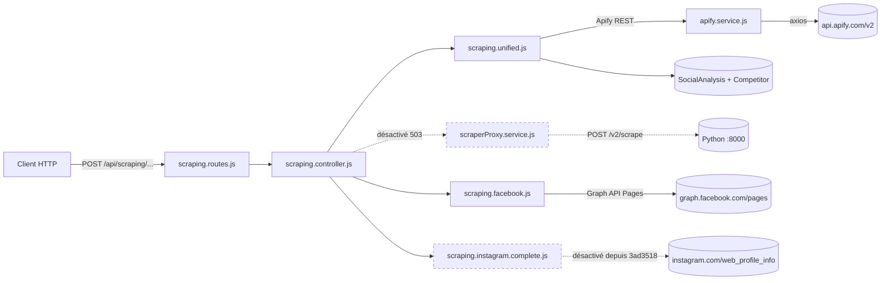
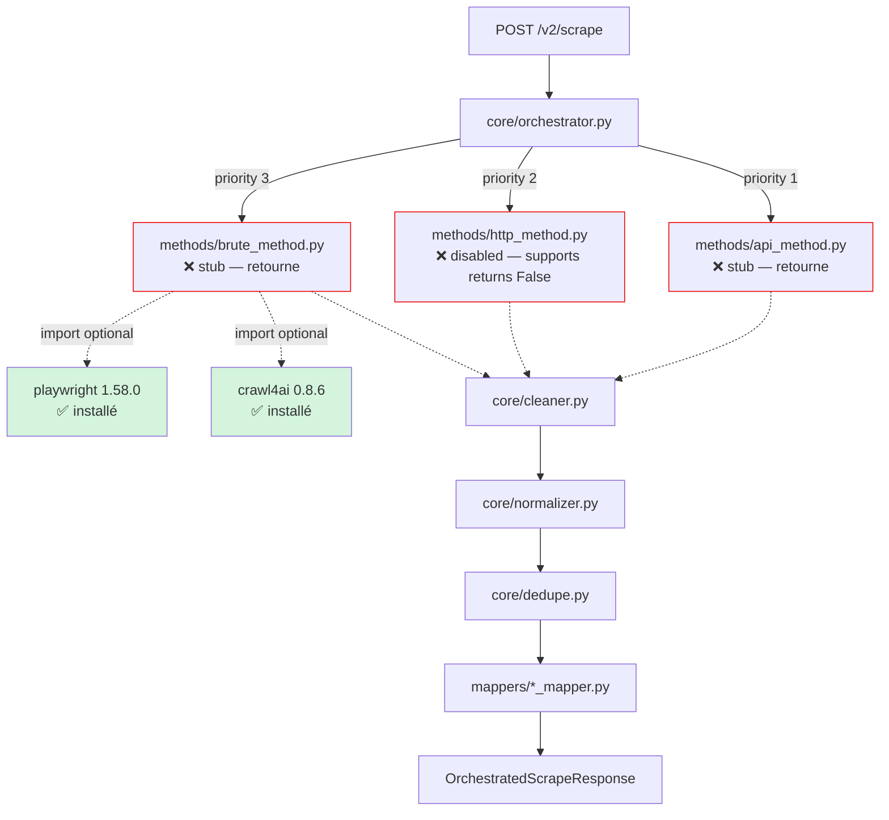
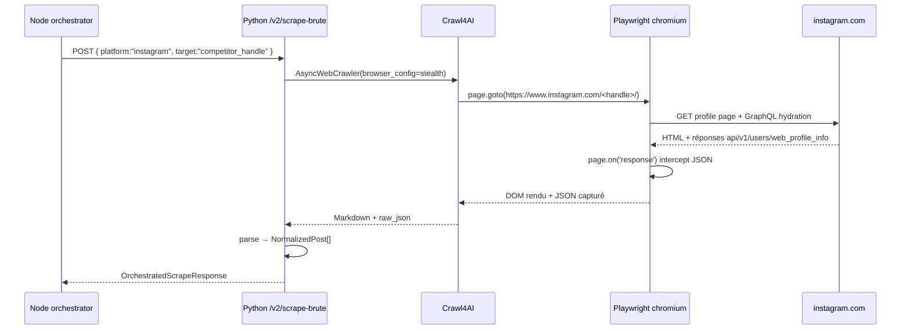
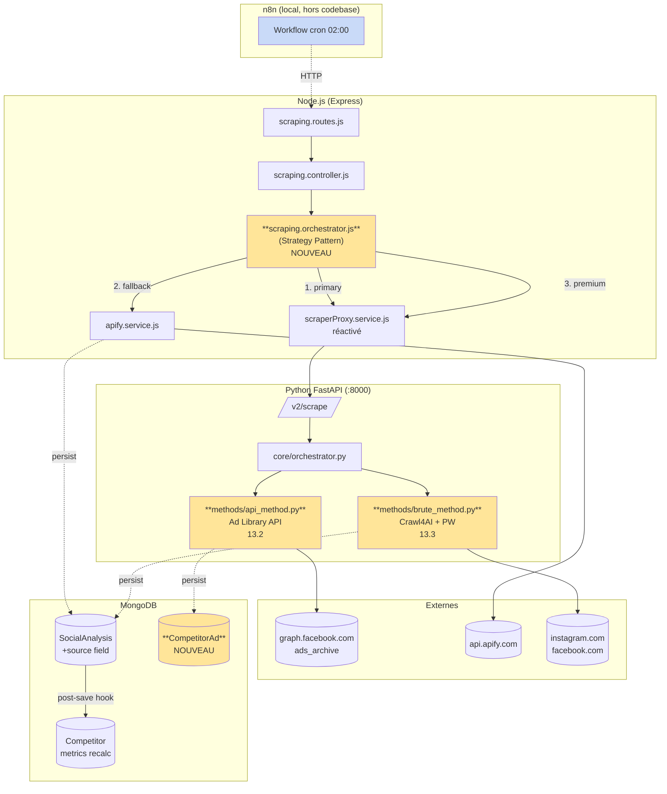
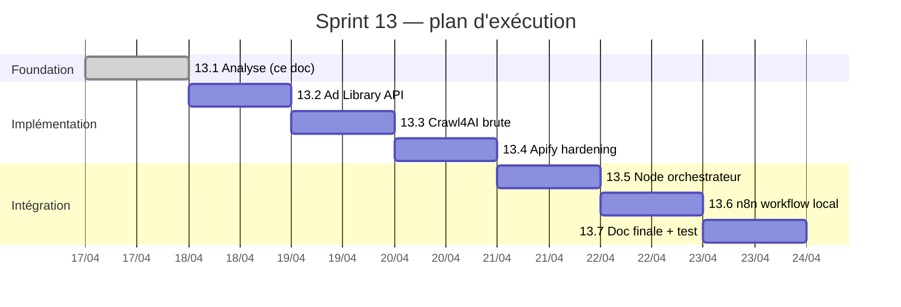

# Sprint 13 — Analyse & Architecture des 3 options de scraping

> **Sous-sprint 13.1** — Document préparatoire. Aucun code modifié.
> **Date:** 2026-04-17

## Résumé exécutif

Le sprint cible **3 stratégies complémentaires** pour récupérer les données publicitaires et organiques de concurrents Facebook + Instagram :

| # | Option | Couverture | Légalité | Fragilité | État actuel |
|---|---|---|---|---|---|
| A | **Meta Ad Library API** | Pubs sponsorisées (FB+IG) | 🟢 Légal officiel | 🟢 Stable | ❌ Non implémentée |
| B | **Crawl4AI + Playwright** | Posts organiques (FB+IG) | 🟡 Zone grise | 🔴 Fragile | ⚙️ Stubs + libs installées |
| C | **Apify actors** | Posts organiques + métriques page | 🟢 Légal (Apify gère) | 🟡 Dépendance externe | ✅ Fonctionnel |

La doctrine d'architecture est un **Strategy Pattern** piloté par un orchestrateur Node qui empile ces 3 sources : API officielle en primaire, Apify en fallback, Crawl4AI en "premium" quand on veut de la richesse organique que Meta ne publie pas.

---

## 1. État actuel du code

### 1.1. Layer Node (Express)



**Observations clés :**
- `apify.service.js` utilise `axios` brut, **pas** le package `apify-client` (pas installé en npm).
- `scraping.facebook.js` utilise `FB_APP_ID/SECRET` pour l'API **Pages** (follower count), pas l'API **Ad Library**.
- L'endpoint `POST /competitor/:id/scrape-v2` qui proxifiait vers Python est actuellement gelé (renvoie 503).
- L'Instagram HTTP direct (`web_profile_info`) est désactivé depuis le commit `3ad3518`.

### 1.2. Microservice Python (FastAPI :8000)



**Observations clés :**
- Squelette complet (orchestrator + pipeline clean/normalize/dedupe + mappers) **déjà en place** depuis le sprint 10.
- Les 3 méthodes sont des stubs prêts à être remplies.
- Crawl4AI 0.8.6 + Playwright 1.58.0 installés depuis l'Étape 3 phase 1.
- Navigateurs Chromium déjà présents dans `C:\Users\Client\AppData\Local\ms-playwright\` (pas de re-download).

---

## 2. Analyse des 3 options

### Option A — Meta Ad Library API

**Endpoint cible**
```
GET https://graph.facebook.com/v21.0/ads_archive
  ?search_terms=<keyword> | search_page_ids=<page_id>
  &ad_type=ALL
  &ad_reached_countries=['TN']
  &publisher_platforms=['instagram','facebook']
  &fields=id,ad_creative_body,ad_snapshot_url,page_name,
          spend,impressions,ad_delivery_start_time,
          ad_delivery_stop_time,languages,publisher_platforms
  &access_token=<APP_TOKEN>
```

**Ce qu'on récupère** (par pub) :
- ID de l'annonce, texte créatif, URL snapshot
- Fourchettes `impressions.lower_bound / upper_bound`, idem pour `spend`
- `page_name`, `publisher_platforms`, langues, dates de diffusion

**Ce qu'on ne récupère pas** : engagement organique (likes, commentaires), follower count, posts non-sponsorisés.

**Coût** : 0 € (quota Graph API gratuit, ~200 req/h/token).

**Prérequis techniques**
- Token Meta Developer app (on a déjà `FB_APP_ID` + `FB_APP_SECRET` → `app_token = <APP_ID>|<APP_SECRET>`).
- **Bloqueur potentiel** : Meta exige parfois qu'un humain soit identifié comme "advertiser" pour certains pays ; à vérifier pour la Tunisie (`ad_reached_countries=['TN']`).

**Effort** : 1h30 (appel HTTP + modèle Mongo + mapping).

---

### Option B — Crawl4AI + Playwright (Brute Force)

**Principe** : piloter Chromium via Playwright, laisser Crawl4AI gérer extraction markdown + anti-détection, intercepter les réponses GraphQL en arrière-plan pour enrichir.

**Architecture envisagée**


**Ce qu'on récupère** (ce que l'API officielle n'a pas) :
- Follower count, following count, post count, bio, is_verified
- Derniers 12-30 posts avec likes/commentaires/timestamps
- Type média (REEL / CAROUSEL / IMAGE), hashtags

**Risques opérationnels**
- Comptes IG fraîchement créés → captcha checkpoint sous 5 min.
- IPs datacenter → shadowban instantané. **Proxies résidentiels quasi obligatoires en prod**.
- Meta patche les endpoints GraphQL tous les 6-8 semaines.

**Config stealth minimale viable** (cf. sprint doc lines 145-154) : UA iPhone iOS 17, viewport 390×844, locale fr-TN, timezone Africa/Tunis, header `x-ig-app-id: 936619743392459`.

**Effort** : 2h pour une version MVP fonctionnelle en local (sans proxy résidentiel). Production-ready = +1 sprint dédié proxies/rotation.

---

### Option C — Apify actors (existant)

**Actors utilisés** : `apify/instagram-profile-scraper`, `apify/facebook-pages-scraper`.

**Flow actuel** (`apify.service.js`) :
1. POST `https://api.apify.com/v2/acts/<actor>/runs?token=<APIFY_TOKEN>` avec input JSON.
2. Poll `GET /runs/<runId>` toutes les 4s (max 3min).
3. Quand `status=SUCCEEDED` → `GET /datasets/<datasetId>/items`.
4. Mapping → `SocialAnalysis` schema.

**Coûts Apify (tarifs standards 2025)**
- `instagram-profile-scraper` : ~$2.3 / 1000 profils
- `facebook-pages-scraper` : ~$5 / 1000 pages
- Usage PFE (10 concurrents × 1 run/jour × 30 jours) = **< $5/mois**

**Forces** : gère fingerprinting, rotation IPs, captchas. Livre directement du JSON structuré.

**Faiblesses** :
- Dépendance externe (si Apify modifie un actor, on subit).
- Pas de pubs sponsorisées (c'est le rôle de l'option A).
- Latence : 30-90s par run (le poll `scrapeProjectSocialMedia` a un `setTimeout(5000)` entre concurrents, raisonnable).

**Effort** : 30 min pour ajouter `source: 'apify'` tagging sur `SocialAnalysis` + vérifier gestion d'erreurs.

---

## 3. Architecture cible (post-sprint 13)



**Principes clés :**
1. **Strategy Pattern** côté Node : chaque source implémente une interface `IAdDataProvider` (méthode `scrape(competitor, platform) → Promise<Result>`). L'orchestrateur choisit selon priorité + quota + fraîcheur.
2. **Source tagging** : chaque doc `SocialAnalysis` / `CompetitorAd` porte un champ `source ∈ {'ad_library_api', 'apify', 'crawl4ai'}` pour traçabilité et dédup.
3. **Nouveau modèle `CompetitorAd`** pour les pubs sponsorisées (schéma séparé de `SocialAnalysis` car nature différente : fourchettes de spend/impressions vs métriques exactes).
4. **n8n isolé** : docker-compose dédié dans `n8n/` hors du codebase principal → aucun impact sur `backend/`.

---

## 4. Matrice de faisabilité

| Critère | Option A (Ad Library) | Option B (Crawl4AI) | Option C (Apify) |
|---|---|---|---|
| **Setup technique** | Token Meta déjà dispo | Libs installées, config stealth à écrire | Token Apify dans `.env` |
| **Effort MVP** | 1h30 | 2h | 30min (harden) |
| **Maintenance/an** | ~2h (renouveler token) | 40-80h (patches Meta) | ~4h (ajuster inputs actors) |
| **Données** | Pubs sponsorisées | Posts organiques + follower | Posts organiques + follower |
| **Risque juridique** | 🟢 API publique officielle | 🟡 TOS gris | 🟢 Apify porte le risque |
| **Coût financier** | 0€ | 0€ + proxys prod (~$20/mo) | ~$5/mois |
| **Blocage probable** | Faible | Élevé (rate limit, captcha) | Moyen (acteur cassé) |
| **Déjà en place** | Rien | Squelette + libs | Service fonctionnel |

---

## 5. Prérequis & questions ouvertes

### À confirmer avant 13.2 (Ad Library)
- [ ] Le token `<FB_APP_ID>|<FB_APP_SECRET>` a-t-il accès à `/ads_archive` pour `ad_reached_countries=['TN']` ? **Test curl à prévoir.**
- [ ] Veut-on stocker les pubs dans une nouvelle collection `competitorAds` ou étendre `SocialAnalysis` avec un champ `sponsoredAds[]` ?  
  **Ma reco :** collection séparée (schéma différent, cycle de vie différent — les pubs tournent sur des fenêtres courtes).

### À confirmer avant 13.3 (Crawl4AI)
- [ ] On teste en local sans proxy résidentiel (IP fixe Windows de l'user) → accepter les blocages comme signal légitime.
- [ ] Cible unique Instagram d'abord, puis Facebook ? **Ma reco :** IG d'abord (structure page plus simple, pas de cookie-wall agressif sur `/<handle>/`).

### À confirmer avant 13.6 (n8n)
- [ ] Utilisateur préfère n8n en Docker ou en `npx n8n` local ? **Ma reco :** Docker (reproductible, isolé, kill à la fin du test).
- [ ] Trigger du workflow : cron (02:00 comme `scraping.cron.js` actuel) ou webhook manuel ?

---

## 6. Ordre d'exécution recommandé



**Justification de l'ordre :**
1. **13.2 en premier** (Ad Library) — ROI maximum, zéro risque juridique, dépendances déjà réunies.
2. **13.3 ensuite** (Crawl4AI) — gros effort technique, isolé dans Python donc pas d'impact Node.
3. **13.4 avant l'orchestrateur** — le service Apify doit parler le même contrat source-tagged que les deux autres avant d'être intégré.
4. **13.5 orchestrateur Node** — assemble les 3 sources, réactive `POST /competitor/:id/scrape-v2`.
5. **13.6 n8n** — wrapper opérationnel autour de l'API déjà stable.
6. **13.7** — consolidation doc + test plan d'acceptation.

---

## 7. Anti-objectifs (hors scope sprint 13)

Pour éviter le scope creep, ces items sont **explicitement hors périmètre** :
- ❌ Proxies résidentiels payants (requiert budget + procédure achat).
- ❌ Refactor du scraping cron (`scraping.cron.js`) — touche pas, marche.
- ❌ Migration `apify-client` npm package (raw axios marche, pas de gain fonctionnel).
- ❌ Support LinkedIn / TikTok (le `supports()` du Python est extensible plus tard).
- ❌ UI frontend pour choisir la source — viendra si besoin, pour l'instant auto-pick.

---

## Statut

| Livrable | État |
|---|---|
| Ce document | ✅ Produit (sprint 13.1 terminé) |
| Validation user | ⏳ En attente |
| Démarrage 13.2 | ⏳ Conditionnel à validation |

**Prochaine action :** l'utilisateur valide l'architecture cible → on enchaîne sur 13.2 (Ad Library API).
